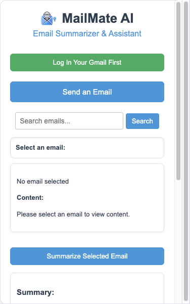
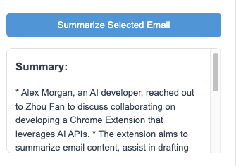
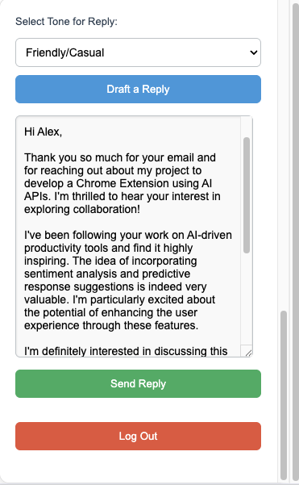
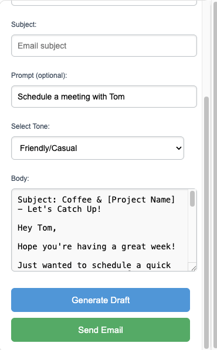

# MailMate AI

**MailMate AI** is a Chrome Extension that serves as an AI-powered email assistant for Gmail. It provides features like email summarization, draft generation, and reply assistance, all powered by Chrome's built-in AI models(Prompt API and Summarization API). The extension aims to enhance productivity by enabling quick email management through AI-driven functionalities.

## Features

- **Email Summarization**: Quickly get summaries of lengthy emails to understand the gist without reading everything.
- **Draft Generation**: Generate drafts for new emails with a selected tone (e.g., Friendly, Neutral, Formal).
- **Reply Assistance**: Draft replies to existing emails based on their content and context, with tone customization.
- **Email Search**: Easily search for specific emails.
- **Load More Emails**: Scroll through and load more emails as needed.

## Technologies Used

- **Chrome Extension APIs**: For authentication and Gmail access.
- **Chrome's Built-in AI Models**: Utilizes models like the Gemini Nano to summarize emails, draft replies, and assist in composing new emails.

## APIs Used

- **Prompt API**: For generating email drafts and replies based on the user’s tone preference. (Since the Write & Rewrite API does not work now, I use Prompt APT for the same purpose)
- **Summarization API**: To summarize lengthy emails, providing users with a quick overview.

## Problem Solved

MailMate AI addresses the problem of managing large volumes of email efficiently. With AI-driven summarization, draft generation, and reply assistance, users can save time and effort on email-related tasks, ultimately increasing productivity and ensuring consistent communication.

## Getting Started

### Prerequisites

- **Chrome Browser**: The extension is designed to work with the Chrome browser.
- **Gmail Account**: Requires authentication through a Google account to access Gmail data.
- **API Permissions**: You must enable permissions to use Gmail and Chrome’s AI models.

### Installation

1. Clone this repository:
   ```bash
   git clone https://github.com/Unknownfanzh/MailMate-AI.git
   ```
2. Go to the Chrome Extensions page (chrome://extensions/) and enable Developer mode.

3. Click Load unpacked and select the folder containing the cloned repository.

4. The MailMate AI extension should now appear in your Chrome Extensions list.

### Setting Up Chrome Built-in AI
To learn more and ensure proper setup of Chrome's built-in AI, follow the instructions here: [Chrome Built-in AI Documentation](https://developer.chrome.com/docs/ai/built-in)

### Setting Up OAuth Credentials for the Extension
To enable Gmail API access, you'll need to set up OAuth credentials for the Chrome Extension:

2. Create a new project or select an existing project.
3. Navigate to **APIs & Services** > **Library**.
4. Search for and enable the **Gmail API**.
5. Navigate to **APIs & Services** > **Credentials**.
6. Click on **Create Credentials** and select **OAuth client ID**.
   - Under **Application type**, select **Chrome Extension**.
   - Provide the **Extension ID** (You can find this from the Chrome Extensions page).
   - Configure the **Authorized JavaScript origins** and **Authorized redirect URIs** if required.
7. Set up the **OAuth consent screen**:
   - Enter your app’s details (name, support email, etc.).
   - Add scopes like `https://www.googleapis.com/auth/gmail.readonly` and `https://www.googleapis.com/auth/gmail.compose` for reading and sending emails.
   - Save and proceed.
8. Open the manifest.json file in the MailMate AI extension directory and replace "YOUR_CLIENT_ID_HERE" with the Client ID generated for your extension.


## Usage

- **Log In**: Click the **Log In** button to authenticate with Gmail and access your email.
- **Summarize Emails**: Select an email from the list and click **Summarize Selected Email** to get an AI-generated summary.
- **Draft New Email**: Click **Send an Email**, fill in the details, choose a tone, and generate a draft.
- **Draft a Reply**: Select an email, click **Draft a Reply**, and choose a tone. MailMate AI will generate a reply based on the email content.

## Screenshots

Main Interface:


Email Summarization Example:


Drafting a Reply:


Draft a New Email:


## Video Demo

Check out the demo video showcasing MailMate AI's features and functionalities: [YouTube Video Link](https://youtu.be/3ejjjcaBERI)


## License

This project is licensed under the MIT License - see the [LICENSE](LICENSE) file for details.

## Acknowledgments

- Thanks to Chrome's built-in AI capabilities for providing the foundation for MailMate AI’s email summarization and drafting.
- Inspired by productivity tools and email clients aiming to streamline communication through automation.

### What's Next

- **Improved Categorization Features**: Add AI-powered categorization of emails to help users sort and prioritize their inboxes more efficiently.
- **Customizable Templates**: Offer users a selection of customizable email templates for common scenarios like meetings, follow-ups, and newsletters.
- **Advanced Analytics**: Introduce analytics features that provide users insights into their email activity, response times, and email sentiment.
- **Mobile Compatibility**: Explore options to extend the MailMate AI experience to mobile devices for on-the-go productivity.